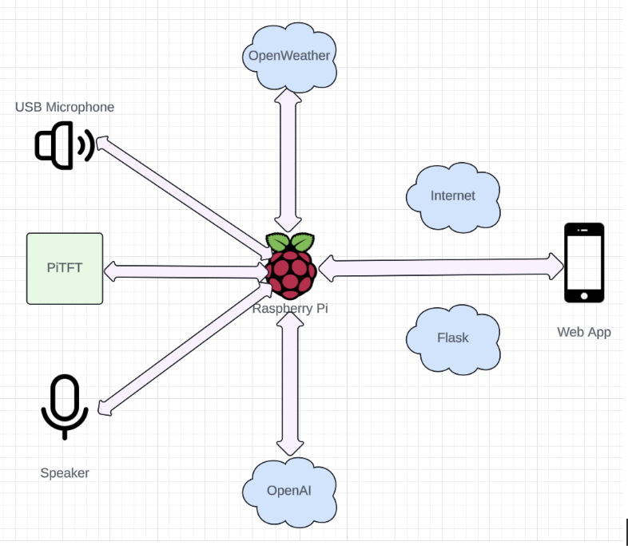
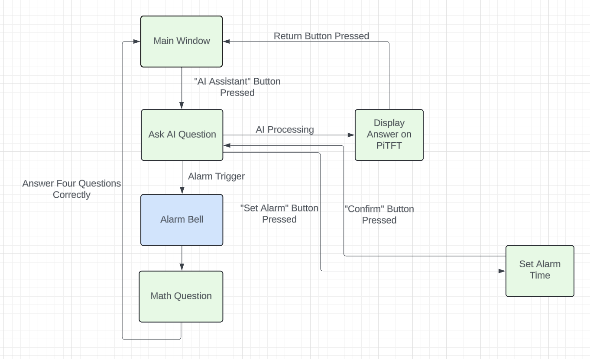

# Smart Alarm Clock for Deep Sleepers

## Overview
The **Smart Alarm Clock for Deep Sleepers** is an intelligent system designed to address challenges faced by deep sleepers. By combining hardware and software, this project ensures an effective wake-up experience through an alarm system integrated with:

- Mandatory math problem-solving for mental alertness.
- AI assistant for interactive morning tasks.
- A web application for remote alarm management.

This project was developed as part of the **ECE 5725 Fall 2024** course at Cornell University.

### Contributors
- **Yongye Li** (yl3734@cornell.edu)
- **Xiaokun Du** (xd239@cornell.edu)

<!--  -->

## Objective
To develop a smart alarm clock system that ensures:

1. Effective wake-ups for deep sleepers.
2. Mental stimulation through math problem-solving.
3. Enhanced usability via a web app for alarm management.
4. AI integration for versatile morning interactions.

## Features

### Hardware
- **Raspberry Pi**: Central processing unit.
- **PiTFT Display**: User-friendly interface for interaction.
- **USB Microphone**: For speech input.
- **Speaker**: For audio alerts and responses.

### Software
- **Alarm Bell with Math Problems**: Users must solve math problems to stop the alarm.
- **AI Assistant**: Powered by OpenAI GPT for answering questions.
- **Web Application**: Flask-based app for remote alarm management.

### Additional Functionalities
- Real-time weather animation on the display.
- Auto-start feature on Raspberry Pi boot-up.

## System Design
The system architecture consists of:

1. **Raspberry Pi**: Main computing unit.
2. **PiTFT Display**: User interaction interface.
3. **SpeechRecognition Library**: Converts speech to text.
4. **Flask Web App**: Synchronizes alarm data with the PiTFT interface via JSON files.



### Workflow
- Set alarms via the PiTFT or the web app.
- AI assistant responds to user queries.
- Alarm triggers math problem-solving on wake-up.
- Weather animations for real-time updates.



## Installation
### Prerequisites
- Raspberry Pi with PiTFT display.
- USB Microphone and Speaker.
- Internet connection for API calls.

### Steps
1. Clone the repository:
   ```bash
   git clone <repository-url>
   cd <repository-folder>
   ```
2. Install dependencies:
   ```bash
   pip install -r requirements.txt
   ```
3. Set up APIs:
   - OpenWeather API key.
   - OpenAI API key.
4. Configure auto-start:
   - Add the provided `clock.sh` script to `.bashrc`:
     ```bash
     echo "bash /path/to/clock.sh" >> ~/.bashrc
     ```
   - Enable auto-login using `sudo raspi-config`.
5. Run the main program:
   ```bash
   python3 main.py
   ```

## Testing
Each component was tested individually:
- Alarm functionality.
- Math problem-solving mechanism.
- AI assistant responses.
- Web app synchronization.
- Integrated system testing under noisy and real-world conditions.

## Result
The project successfully met all objectives, ensuring:
- Reliable wake-ups.
- Enhanced user engagement.
- Seamless integration of hardware and software features.

## Future Work
- Develop a mobile app for enhanced remote management.
- Upgrade the user interface for better usability.
- Integrate text-to-speech for the AI assistant to provide audible responses.

## Parts List
- **Raspberry Pi**: $35.00
- **USB Microphone**: $8.00
- **Speaker**: Provided in lab
- **PiTFT Display**: $45.00

**Total Cost**: $88.00

## References
- [Pigpio Library](http://abyz.co.uk/rpi/pigpio/)
- [Pygame Documentation](https://www.pygame.org/docs/)
- [R-Pi GPIO Documentation](https://sourceforge.net/p/raspberry-gpio-python/wiki/Home/)
- [OpenWeatherMap API](https://openweathermap.org/api)
- [OpenAI API](https://openai.com)
- [SpeechRecognition Library](https://pypi.org/project/SpeechRecognition/)
- [Pygame Text Rect Module](https://www.pygame.org/pcr/text_rect/index.php)

---

For any inquiries or contributions, feel free to contact the contributors listed above!
